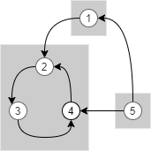
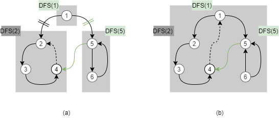

## Strongly connected component

방향 그래프 $$ G(V,E) $$에 대해서 **Strongly connect component**(이하  SCC) 는 다음 조건을 만족하는 $$ S \subset V $$를 말한다.
$$
a \in S \land b \in S \land a \neq b \rightarrow \exists (a \rightsquigarrow b) \land \exists (b \rightsquigarrow a)
$$

즉, 위 그림에서 처럼 SCC에 속한 임의의 두 노드 $$ a $$, $$ b $$에 대해 $$ a $$ 에서 $$ b $$ 로 가는 경로가 있으면, $$ b $$ 에서 $$ a $$로 가는 경로도 존재해야 한다.
SCC는 방향 그래프 $$G$$의 모든 노드를 disjoint set으리 분할하는 것을 알 수 있다. 
이러한 SCC를 계산하는 알고리즘으로는 Kosaraju 알고리즘, Tarjan 알고리즘 등이 있다. 이 글에서는 Tarjan 알고리즘에 대해 설명한다.

## Tarjan's SCC algorithm
Tarjan 알고리즘은 $$G$$의 DFS 스패닝 트리에서 일부 트리 간선을 잘라 모든 SCC를 찾아낸다. 이러한 알고리즘이 존재한다는 것을 다음 정리를 통해 알 수 있다.

> **Theorem1. (Existence)**  임의의 그래프 $$G$$의 DFS 스패닝 트리의 트리 간선을 적절히 잘라 얻은 포레스트를 $$F$$라 하자. 임의의 SCC $$S$$에 대해 $$ S=V(T) $$인 트리 $$T \in F$$가 항상 존재하도록 하는 $$F$$가 항상 존재한다. 

**Proof.**
어떤 알고리즘 `DFS(u)`가 조건을 만족하는 $$F$$를 반환한다고 하자. 이 알고리즘이 어떤 SCC $$S$$를 정점 $$x$$에서 처음 방문한다고 하자. `DFS(x)`가 종료하기 전에 $$ST(x)$$ 의 모든 노드가 방문된다.  
만약 다음 두 조건이 모두 참이면 트리 간선을 잘라 SCC를 구분할 수 없다.  

1. 새로운 SCC $$T \neq S$$에 속하면서 $$ ST(x) $$에 속하는 어떤 정점 $$z$$가 존재한다.
2. $$ ST(z) $$에 속하는 어떤 정점 $$ y \in S $$ 가 존재한다.   

위의 두 조건은 동시에 참일 수 없음을 귀류법을 통해 증명하자. 두 조건이 모두 참이라고 가정한다. 그러면 $$x$$ 와 $$y$$는 같은 SCC에 속하므로 경로 $$y \rightsquigarrow x$$가 존재한다. 따라서 경로 $$z \rightsquigarrow y \rightsquigarrow x$$가 존재한다. 
따라서 $$x$$와 $$z$$는 같은 SCC에 속해야 한다. 이는 모순이므로 위 두 가지 조건 중 적어도 하나는 거짓이다.  
- 둘 다 거짓인 경우: $$x$$에서 부모로 가는 트리 간선을 끊으면 $$S=V(F(x))$$이다.
- 첫 번째 조건만 거짓인 경우: 위와 같다.
- 두 번째 조건만 거짓인 경우: $$x$$에서 부모로 가는 트리 간선과 $$z$$에서 부모로 가는 트리 간선을 끊으면 $$S=V(F(x))$$이다. `DFS(z)` 가 실행되는 순간 부터는 같은 논리를 `1.` 에서 부터 재귀적으로 적용해 나갈 수 있음을 알 수 있다.  

따라서 임의의 방향 그래프 $$G$$에 대해 문제 조건을 만족하는 알고리즘 `DFS(u)`는 항상 존재한다.∎ 

**Theorem1**을 통해 `DFS(u)`가 존재하는 것을 알 수 있다. 하지만 어떤 트리 간선을 끊어야 할까? 트리 간선 $$(u,v)$$를 끊는다는 것은 $$v \rightsquigarrow u$$가 존재하지 않는다는 의미이다. 즉, 다음 두 가지  조건을 만족해야 한다. 
1. $$ST(v)$$에서 역방향 간선을 통해 도달할 수 있는 가장 높은 노드 $$a$$가 $$u$$보다 아래이다.  
2. $$ST(v)$$에서 교차 간선을 통해 도달한 노드 $$b$$에서 도달할 수 있는 가장 높은 노드 $$c$$가 $$u$$보다 아래이다.

잘 생각해 보면 두 번째 조건은 $$c$$를 구하지 않고도 판정할 수 있다. $$b$$가 속하는 $$ST(u)$$의 서브트리가 $$ST(x)$$라고 하자. 즉, $$x$$는 $$b$$의 조상이며, 동시에 $$u$$의 자식이다. `DFS(x)`는 이미 종료되었기 때문에 $$x$$를 포함한 $$ST(x)$$의 모든 노드가 $$u$$와 같은 SCC에 속하는지 여부를 판정할 수 있다.  
- $$u$$와 $$x$$가 같은 SCC에 속하는 경우: 
  $$ST(v)$$에 속하는 노드 $$i$$에서 교차 간선을 통해 노드 $$b$$에 연결된다고 하자.
  $$ST(x)$$에 속하는 노드 $$d$$에서 $$u$$로 가는 경로 $$d \rightsquigarrow u$$가 존재하므로, 경로 $$i \rightsquigarrow b \rightsquigarrow d \rightsquigarrow u$$를 통해 $$v$$와 $$u$$는 같은 SCC에 속함을 알 수 있다.
- $$u$$와 $$x$$가 다른 SCC에 속하는 경우: 
  $$ST(v)$$에 속하는 노드 $$i$$에서 교차 간선을 통해 노드 $$b$$에 연결된다고 하자.
  $$u$$와 $$x$$는 다른 SCC에 속하므로 $$ST(x)$$의 어떤 노드에서도 $$u$$로 가는 경로가 존재하지 않는다. 따라서 $$(i,b)$$ 간선을 통해서 $$u$$로 도달할 수 없다. 

따라서 $$ST(v)$$의 어떤 역방향 간선 $$(j,a)$$에 대해 $$a$$가 $$u$$이상이거나, 어떤 교차 간선 $$(i,b)$$에 대해 $$b$$가 $$u$$와 같은 SCC에 속한다면 $$v$$와 $$u$$는 같은 SCC에 속하며, 이외의 경우에는 다른 SCC에 속한다. 이제 우리는 Tarjan 알고리즘을 구현할 수 있다.

위 그림 (a)의 경우, `DFS(5)`에서 교차 간선 $$(5,4)$$를 탐색 중이다. 이미 종료된 `DFS(2)`의 결과로 $$1$$과 $$4$$가 다른 SCC에 속함을 알고 있다. $$ST(5)$$에 속하는 교차 간선 $$(5,4)$$을 통해 도달하는 $$4$$는 $$1$$과 다른 SCC에 속하며, 역방향 간선 $$(6,5)$$를 통해서 도달하는 $$5$$는 $$1$$보다 아래에 있다. 따라서 $$1$$과 $$5$$는 다른 SCC에 속한다.  
한편 (b)의 경우에는 `DFS(5)`에서 교차 간선 $$(5,4)$$를 탐색 중이다. 이미 종료된 `DFS(2)`를 통해 $$4$$가 $$1$$과 같은 SCC에 속하는 것을 알고 있다. 따라서 $$5$$와 $$1$$은 같은 SCC에 속한다.

## Implementation 

vector<int> sccId;
vector<int> discovered;
vector<int> adj[MAXV];
stack<int> st;
int sccCounter, vertexCounter;

int dfs(int here) {
  int ret = discovered[here] = vertexCounter++;
  st.push(here);
  for (int there : adj[here]) {
    if (discovered[there]==-1)
      ret = min(ret, dfs(there));
    else if (sccId[there]==-1)
      ret = min(ret, discovered[there]);
  }

  if (ret==discovered[there]) {
    while (1) {
      int t = st.top();
      st.pop();
      sccId[t] = sccCounter;
      if (t==here) break;
    }
    ++sccCounter;
  }
  return ret;
}


## Notations
이 글에서 사용한 기호의 정의는 다음과 같다.  
$$u \rightsquigarrow v$$ $$:=$$ 노드 $$u$$에서 노드 $$v$$로 가는 경로. 
$$V(G)$$ $$:=$$ 그래프 $$G$$의 노드 집합.  
$$ST(u)$$ $$:=$$ 노드 $$u$$를 루트로 하는 서브트리.  
$$F(u)$$ $$:=$$ 포레스트 $$F$$에서 노드 $$u$$가 속한 트리.  

## Problems
[백준 1108](http://www.boj.kr/1108)
